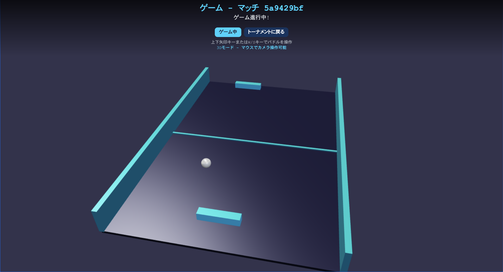

# TRANSCENDENCE

## 技術スタック
### フロントエンド 
- シングルページアプリケーション (SPA)
- Typescript
- tailwind css
- Babylon.js

### バックエンド 
- Fastify
- Node.js

### コンテナ
- docker
- docker-compose

## サービス仕様
### pongゲームシステム
2人のプレイヤーがリモートでプレイできる必要があります。各プレイヤーは別々のコンピューターに配置され、同じウェブサイトにアクセスして同じPongゲームをプレイします。

### トーナメントシステム
プレイヤーは別のプレイヤーと対戦できる必要があり、トーナメントシステムも利用可能である必要があります。このトーナメントは、交代で対戦できる複数のプレイヤーから構成されます。トーナメントの実装方法は柔軟ですが、誰が誰と対戦するか、プレイの順序を明確に表示する必要があります。

### 登録システム
登録システムが必要です：トーナメントの開始時、各プレイヤーは自分の別名を入力する必要があります。

# モジュール (3.5/7)
https://claude.ai/chat/04271923-4f06-4657-a323-3d0b2039f3df

- メジャーモジュール：フレームワークを使用してバックエンドを構築  
このメジャーモジュールでは、バックエンド開発に特定のウェブフレームワークを使用する必要があります：Fastify with Node.js。  
必須部分で指定されたデフォルトのバックエンド言語を使用して、このモジュールの制約を使用せずにバックエンドを作成できます。ただし、このモジュールは要件に従った場合のみ有効です。   
- マイナーモジュール：フレームワークまたはツールキットを使用してフロントエンドを構築  
フロントエンド開発では、Typescriptに加えてTailwind CSSを使用し、それ以外は何も使用しません。   
必須部分で指定されたデフォルトのフロントエンド指示を使用して、このモジュールの制約を使用せずにフロントエンドを作成できます。ただし、このモジュールは要件に従った場合のみ有効です。
- メジャーモジュール：リモートプレイヤー  
2人のプレイヤーがリモートでプレイできる必要があります。各プレイヤーは別々のコンピューターに配置され、同じウェブサイトにアクセスして同じPongゲームをプレイします。   
予期しない切断やラグなどのネットワークの問題を考慮してください。
可能な限り最高のユーザー体験を提供する必要があります
- メジャーモジュール：高度な3D技術の実装  
このメジャーモジュール「Graphics」は、Pongゲームの視覚的側面を強化することに焦点を当てています。より没入的なゲーム体験を作成するために高度な3D技術の使用を導入します。具体的には、望ましい視覚効果を達成するためにBabylon.jsを使用してPongゲームが開発されます。
◦    
高度な3Dグラフィックス：このモジュールの主要目標は、Pongゲームの視覚品質を向上させるために高度な3Dグラフィックス技術を実装することです。Babylon.jsを利用することにより、プレイヤーをゲーム環境に没入させる素晴らしい視覚効果の作成を目標とします。
◦   
没入的ゲームプレイ：高度な3D技術の組み込みにより、ユーザーに視覚的に魅力的で魅惑的なPongゲームを提供することで全体的なゲームプレイ体験を向上させます。
◦    
技術統合：このモジュールで選択された技術はBabylon.jsです。これらのツールを使用して3Dグラフィックスを作成し、互換性と最適なパフォーマンスを確保します。  
このメジャーモジュールは、高度な3D技術を導入することでPongゲームの視覚要素を革新することを目的としています。Babylon.jsの使用を通じて、プレイヤーに没入的で視覚的に素晴らしいゲーム体験を提供することを目指します。